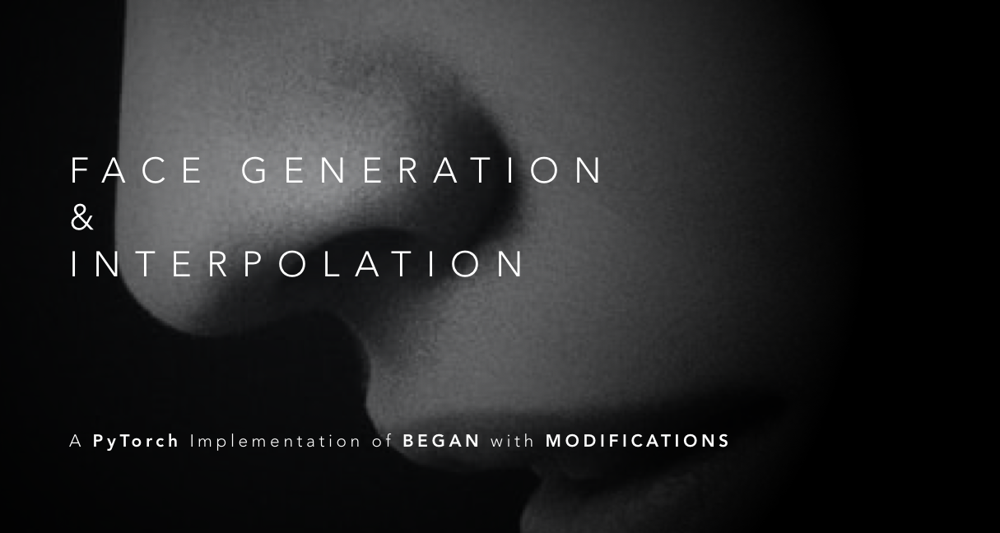
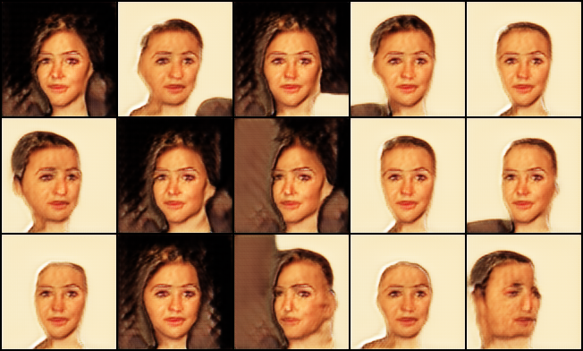

# Face Generation and Interpolation with BEGAN (PyTorch)



This project is about generating fake faces from random noise vector. The model is trained on [CelebFaces](http://mmlab.ie.cuhk.edu.hk/projects/CelebA.html) dataset, so we can generate beautiful faces.


## Methods

The method applied is based on [BEGAN](https://arxiv.org/abs/1703.10717) (David et al.), with following modifications:

1. Configurable upsample method: tranposed convolutional layer or nearest neighbour.
2. Configurable repetitive number of layers in each convolutional block.
3. Configurable input size ($8*2^n$).

The code should be self-explanatory because each class and function contains docstring and parameter description.


## Usage

1. Download the data at this [link](https://drive.google.com/file/d/1EtIVXDLFNI1szq6mAso0746tm4sFxGBR/view?usp=sharing), place the zip file in the root folder.

2. Create two folders under the root folder:

   ```
   mkdir data_faces output
   ```

3. Train the model with default setting:

   ```
   python train.py
   ```

4. Train the model with configuration

   ```
   python train.py --input_dim 128 --output_dim 128 --t_conv True
   ```

   

## Configurable Parameters

**1. Model Parameters**

| Param      | Default | Type  | Note                                                         |
| ---------- | ------- | ----- | ------------------------------------------------------------ |
| input_dim  | 32      | int   | The height / width of the input image to network             |
| output_dim | 32      | int   | The height / width of the output image of the network        |
| nz         | 64      | int   | Size of the latent z vector                                  |
| hidden_dim | 64      | int   | Hidden dimension of the auto encoder, should equal to nz     |
| ngf        | 64      | int   | The number of filters in the generator.                      |
| ndf        | 64      | int   | The number of filters in the discriminator.                  |
| nc         | 3       | int   | The number of input channels.                                |
| n_layers   | 2       | int   | The number of repetitive (Conv2d + ELU) structure.           |
| exp        | False   | bool  | Decide the way of growth of the number of layers in the 2nd conv block. True if exponentially, False if Linearly |
| t_conv     | False   | bool  | Decide the way of upsampling. True if use nn.ConvTranspose2d, False if use nn.UpsamplingNearest2d. |
| mean       | 0       | float | The desired mean of the initialized weight                   |
| std        | 0.002   | float | The desired standard deviation of the initialized weight.    |

**2.Training Parameters**

| Param           | Default      | Type  | Note                                                         |
| --------------- | ------------ | ----- | ------------------------------------------------------------ |
| batch_size      | 16           | int   | Dataloader batch size.                                       |
| n_epochs        | 1000         | int   | Number of epochs to train for.                               |
| lr              | 0.0002       | float | Learning rate.                                               |
| b1              | 0.5          | float | Beta1 for Adam optimizer.                                    |
| b2              | 0.999        | float | Beta2 for Adam optimizer.                                    |
| outf            | ./output/    | str   | Folder to output images and model checkpoints.               |
| data_path       | ./data_faces | str   | Which dataset to train on.                                   |
| lambda_k        | 0.001        | float | Learning rate of k.                                          |
| gamma           | 0.75         | float | Balance bewteen Discriminator and Generator.                 |
| sample_interval | 1000         | int   | Save constructed images every this many iterations.          |
| show_every      | 100          | int   | Show log info every this many iterations.                    |
| lr_update_step  | 3000         | int   | Decay lr this many iterations.                               |
| lr_gamma        | 0.5          | float | The gamma of lr_scheduler, multiplicative factor of lr decay. |


## Results

The model is running. Below is the current results (2nd epochs).



The results for interpolation will also be added after the training ends.